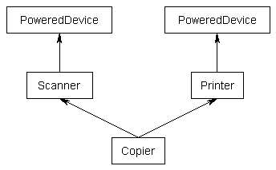

# 12.7 虚基类 (Virtual base classes)

上一章，在[第11.7课——多重继承中]()，我们留下了一个“钻石问题”。在本节中，我们将继续讨论。

**注意：** 本节是一个高级主题，如果需要可以跳过或略过。

## 钻石问题 (The diamond problem)

以下是上一课中的示例（使用一些构造函数）来说明菱形问题：

```c++
class PoweredDevice
{
public:
    PoweredDevice(int power)
    {
  cout << "PoweredDevice: " << power << '\n';
    }
};

class Scanner: public PoweredDevice
{
public:
    Scanner(int scanner, int power)
        : PoweredDevice(power)
    {
  cout << "Scanner: " << scanner << '\n';
    }
};

class Printer: public PoweredDevice
{
public:
    Printer(int printer, int power)
        : PoweredDevice(power)
    {
  cout << "Printer: " << printer << '\n';
    }
};

class Copier: public Scanner, public Printer
{
public:
    Copier(int scanner, int printer, int power)
        : Scanner(scanner, power), Printer(printer, power)
    {
    }
};
```

尽管你可能觉得我们得到了这样的图形：


如果要创建一个Copier类对象，默认情况下，您将得到PoweredDevice类的两个副本，一个来自Printer，一个来自Scanner。其结构如下：



我们可以创建一个简短的测试来说明这一点：

```c++
int main()
{
    Copier copier(1, 2, 3);

    return 0;
}
```

这将产生结果

```bash
PoweredDevice: 3
Scanner: 1
PoweredDevice: 3
Printer: 2
```

如你所见，PoweredDevice被构造了两次。

虽然这是经常需要的，但有时您可能只希望扫描仪和打印机共享PoweredDevice的一个副本。

## 虚基类 (Virtual base classes)

要共享基类，只需在派生类的继承列表中插入“virtual”关键字。这将创建所谓的虚拟基类，这意味着只有一个基类对象。基对象在继承树中的所有对象之间共享，并且只构造一次。下面是一个示例（为简单起见，不使用构造函数）演示如何使用virtual关键字创建共享基类：

```c++
class PoweredDevice
{
};

class Scanner: virtual public PoweredDevice
{
};

class Printer: virtual public PoweredDevice
{
};

class Copier: public Scanner, public Printer
{
};
```

现在，当您创建一个Copier类对象时，每个 Copier 只会得到一个 PoweredDevice 副本，该副本将由 Scanner 和 Printer 共享。

然而，这又引出了一个问题：如果 Scanner 和 Printer 共享PoweredDevice基类，谁负责创建它？事实证明，答案是 Copier。Copier 构造函数负责创建 PoweredDevice。因此，这允许 Copier 直接调用 **非直接 (non-immediate-parent)** 构造函数：

```c++
#include <iostream>

class PoweredDevice
{
public:
    PoweredDevice(int power)
    {
  std::cout << "PoweredDevice: " << power << '\n';
    }
};

class Scanner: virtual public PoweredDevice // note: PoweredDevice 现在是一个虚基类
{
public:
    Scanner(int scanner, int power)
        : PoweredDevice(power) // 这行是创建 Scanner 必要的，在这个例子里我们可以忽略。
    {
  std::cout << "Scanner: " << scanner << '\n';
    }
};

class Printer: virtual public PoweredDevice // note: PoweredDevice 现在是一个虚基类
{
public:
    Printer(int printer, int power)
        : PoweredDevice(power) // 这行是创建 Printer 必要的，在这个例子里我们可以忽略。
    {
  std::cout << "Printer: " << printer << '\n';
    }
};

class Copier: public Scanner, public Printer
{
public:
    Copier(int scanner, int printer, int power)
        : PoweredDevice(power), // PoweredDevice 在这里进行构造
        Scanner(scanner, power), Printer(printer, power)
    {
    }
};
```

还是用前面的例子

```c++
int main()
{
    Copier copier(1, 2, 3);

    return 0;
}
```

产生结果

```bash
PoweredDevice: 3
Scanner: 1
Printer: 2
```

如您所见，PoweredDevice只构建一次。

有一些细节，如果我们我们必须要说明

**首先：** 虚基类总是在非虚基类之前创建，这确保所有基类在派生类之前创建。

**其次：** 请注意 Scanner 和 Printer 构造函数仍有调用 PoweredDevice 的构造函数。创建 Copier 实例时，这些构造函数调用被忽略，因为 Copier 负责创建 PoweredDevice ，而不是 Scanner 或 Printer 。但是，如果我们要创建 Scanner 或 Printer 的实例，那么调用那些构造函数，并应用常规继承规则。

**第三：** 如果一个类继承了一个或多个具有虚基类的类，则 **末端派生(most derived)** 的类负责构造虚基类。在本例中，Copier 继承 Printer 和 Scanner ，它们都有一个 PoweredDevice 虚拟基类。Copier 是最派生的类，负责创建 PoweredDevice 。请注意，即使在单一继承情况下也是如此：如果 Copier 是从 Printer 单独继承的，而 Printer 实际上是从 PoweredDevice 继承的，Copier 仍然负责创建 PoweredDevice 。

**第四：** 继承一个虚拟基类的所有类都将有一个虚拟表，即使它们通常不会有，实例化的对象会因为这个指针增加一些尺寸。

因为 Scanner 和 Printer 是从 PoweredDevice 虚继承出来的，所以 只有一个 PoweredDevice 子对象。Scanner 和 Printer 都需要知道如何找到这个 PoweredDevice 子对象，以便访问它的成员（因为毕竟，它们是从它派生的）。这通常是通过一些虚表来实现的（它实际上存储了从每个子类到 PoweredDevice 子对象的偏移量）。
