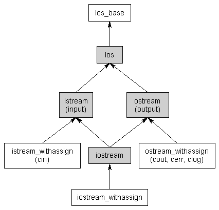

# 18.1 - 输入输出流

18.1 — Input and output (I/O) streams

> By Alex on February 28th, 2008 | last modified by Alex on January 23rd, 2020
> 翻译By dashjay

<!-- Input and output functionality is not defined as part of the core C++ language, but rather is provided through the C++ standard library (and thus resides in the std namespace). In previous lessons, you included the iostream library header and made use of the cin and cout objects to do simple I/O. In this lesson, we’ll take a look at the iostream library in more detail. -->

输入和输出功能没有定义作为 C++ 的核心部分，但是也被通过 C++ 的标准库提供（也存在于 std 命名空间）。在之前的课程中，你引用了 `<iostrea>` 库的头部并且使用 `cin` 和 `cout` 对象来做简单的 I/O. 在这个课程中，我们会更详细的看一下啊 `iostream` 库。

## The iostream library

<!-- When you include the iostream header, you gain access to a whole hierarchy of classes responsible for providing I/O functionality (including one class that is actually named iostream). The class hierarchy for the non-file-I/O classes looks like this: -->

当你引用了 `iostream` 的头部，你可以访问整个 I/O 的架构。（引入了一个名字叫做 `iostream` 的类）。类结构（非文件IO）看起来像这样：

<!-- The first thing you may notice about this hierarchy is that it uses multiple inheritance (that thing we told you to avoid if at all possible). However, the iostream library has been designed and extensively tested in order to avoid any of the typical multiple inheritance problems, so you can use it freely without worrying. -->

第一件你可能注意到的事情就是它使用了多继承（以前我们说过要避免的）。然而，`iostream` 库被设计并且广泛地测试避免多继承的问题，因此你可以不用丝毫担心的使用它。

## 流

Streams

<!-- The second thing you may notice is that the word “stream” is used an awful lot. At its most basic, I/O in C++ is implemented with streams. Abstractly, a stream is just a sequence of bytes that can be accessed sequentially. Over time, a stream may produce or consume potentially unlimited amounts of data. -->

第二件你可能注意到的就是单词 `stream` ，它经常被滥用。作为最基础的基类，C++ 中的 I/O 使用流来实现。抽象来讲，一个 `stream` 就是一个字节序列可以被按顺序访问。随着时间的推移，一个 `stream` 可能产生或者消费潜在的无限的数据。

<!-- Typically we deal with two different types of streams. Input streams are used to hold input from a data producer, such as a keyboard, a file, or a network. For example, the user may press a key on the keyboard while the program is currently not expecting any input. Rather than ignore the users keypress, the data is put into an input stream, where it will wait until the program is ready for it. -->

通常，我们处理两种不同类型的流。输入流被用来从一个数据生产者维持输入，例如一次键盘触发，一个文件，或者一个网络。例如，用户可能按下一个按钮当程序没有期待任何输入。不会忽略用户的按键，而是把数据放进输入流中，它会等待知道程序接收这个输入。

<!-- Conversely, output streams are used to hold output for a particular data consumer, such as a monitor, a file, or a printer. When writing data to an output device, the device may not be ready to accept that data yet -- for example, the printer may still be warming up when the program writes data to its output stream. The data will sit in the output stream until the printer begins consuming it. -->

相反的，输出流被用来持续输出提供给特定的数据消费者，例如一个显示器，一个文件或者一个打印机。当写数据到任何设备，并且设备可能没有准备好接收数据 ———— 例如，打印机仍然正在预热当程序尝试写入数据到它的输出流。数据将会在输出流等待，直到开始消费它。

<!-- Some devices, such as files and networks, are capable of being both input and output sources. -->
一些设备，列如文件和网路，有能力作为输入和输出源。

<!-- The nice thing about streams is the programmer only has to learn how to interact with the streams in order to read and write data to many different kinds of devices. The details about how the stream interfaces with the actual devices they are hooked up to is left up to the environment or operating system. -->

流的好处就是程序员只需要学会简单的交互，就可以在不同的设备中读写数据。流实际上如何与连接到它的实际设备接口进行沟通由操作系统决定。

## C++ 中的输入输出

<!-- Input/output in C++ -->

<!-- Although the ios class is generally derived from ios_base, ios is typically the most base class you will be working directly with. The ios class defines a bunch of stuff that is common to both input and output streams. We’ll deal with this stuff in a future lesson. -->

尽管 `ios` 派生自 `ios_base`，`ios` 通常是你会使用的最基础的类。`ios` 类定义了很多东西，常见于输入输出流。我们将会在未来的课程中使用他们。

<!-- The istream class is the primary class used when dealing with input streams. With input streams, the extraction operator (>>) is used to remove values from the stream. This makes sense: when the user presses a key on the keyboard, the key code is placed in an input stream. Your program then extracts the value from the stream so it can be used. -->

`istream` 类是一个基础类，被使用为输入流。使用输入流，提取操作符(>>) 被用来移除流中的值。这是有意义的：当用户按下键盘的键，输入的键码被放在输入流中。你的程序紧接着会提取这个值当它可用时。

<!-- The ostream class is the primary class used when dealing with output streams. With output streams, the insertion operator (<<) is used to put values in the stream. This also makes sense: you insert your values into the stream, and the data consumer (eg. monitor) uses them. -->

`ostream` 类是基础的处理输出流的类。使用输出流，插入操作符(<<)被用来将值放入流中。这也很有意义：你插入你的值到流中，数据之后会被消费者（例如：显示器）使用。

## `iostream` 类可以同属处理输入和输出，允许双向I/O

<!-- The iostream class can handle both input and output, allowing bidirectional I/O. -->

<!-- Finally, there are a bunch of classes that end in “_withassign”. These stream classes are derived from istream, ostream, and iostream (respectively) with an assignment operator defined, allowing you to assign one stream to another. In most cases, you won’t be dealing with these classes directly. -->

最后，有几个类名以 `_withassign` 结尾的类。这些流类派生自 `istream`，`ostream`和 `iostream`（分别的）带有一个 赋值操作符定义，允许你赋值一个流给另一个。在大多数情况下，你不会直接操作这些类。

## C++ 中的标准流

<!-- Standard streams in C++ -->

A standard stream is a pre-connected stream provided to a computer program by its environment. C++ comes with four predefined standard stream objects that have already been set up for your use. The first three, you have seen before:

一个标准流是，提供给一个电脑程序的一个预链接的流（A standard stream is a pre-connected stream provided to a computer program by its environment.）。C++ 附带了4个预定义的标准流，被定义来提供给你使用的，你之前看到过的：

- cin —— 一个 `istream_withassign` 类，连接到标准输入（通常是键盘）
- cout —— 一个 `ostream_withassign` 类，连接到标注输出（通常是显示器）
- cerr —— 一个 `ostream_withassign` 类，连接到标准错误（通常是显示器），提供无buffer的输出
- clog —— 一个 `ostream_withassign` 类，连接到标准错误（通常是显示器），提供有buffer的输出

    <!-- cin -- an istream_withassign class tied to the standard input (typically the keyboard)
    cout -- an ostream_withassign class tied to the standard output (typically the monitor)
    cerr -- an ostream_withassign class tied to the standard error (typically the monitor), providing unbuffered output
    clog -- an ostream_withassign class tied to the standard error (typically the monitor), providing buffered output  -->

<!-- Unbuffered output is typically handled immediately, whereas buffered output is typically stored and written out as a block. Because clog isn’t used very often, it is often omitted from the list of standard streams. -->

无 buffer 点的输出通常被立刻执行，而带buffer的输出通常被储存并且以块为单位写出。因为 clog 不是很常用，它通常也被标准流列表中忽略。

<!-- In the next lesson, we’ll take a look at some more I/O related functionality in more detail. -->

在接下来的课程中，我们将会看更多的 I/O 相关的详细功能
